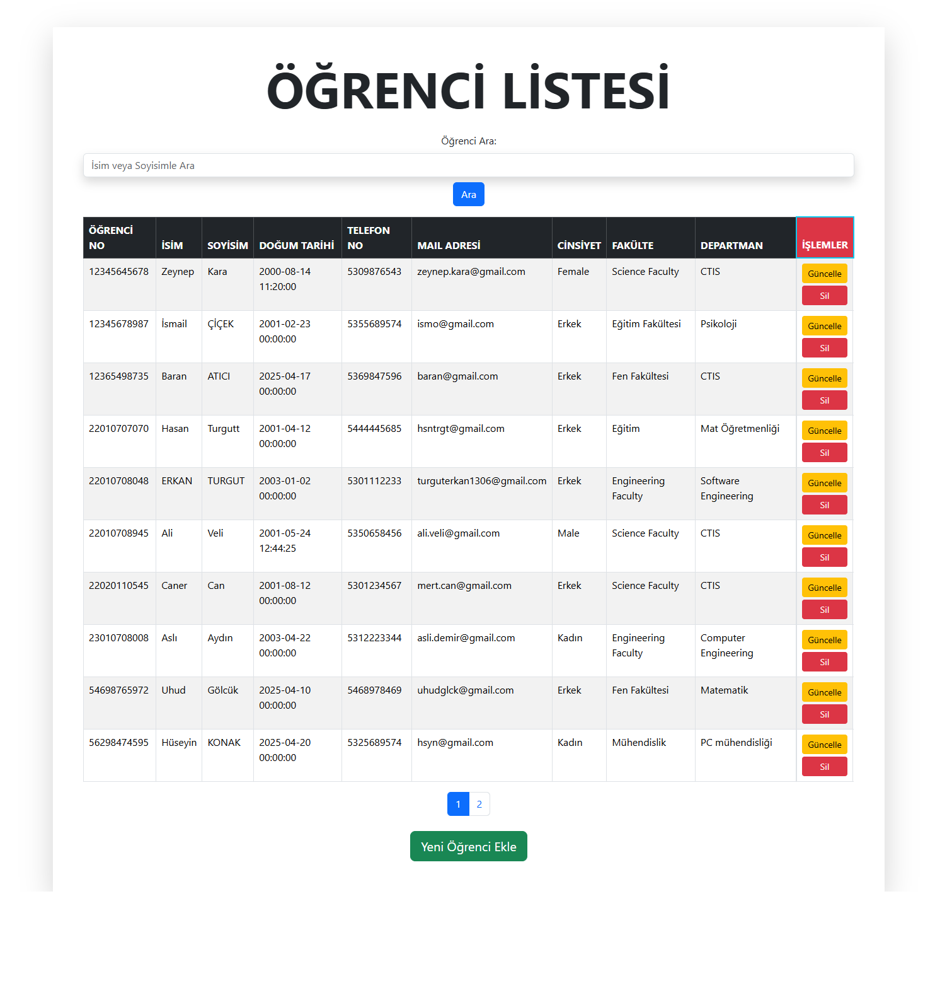
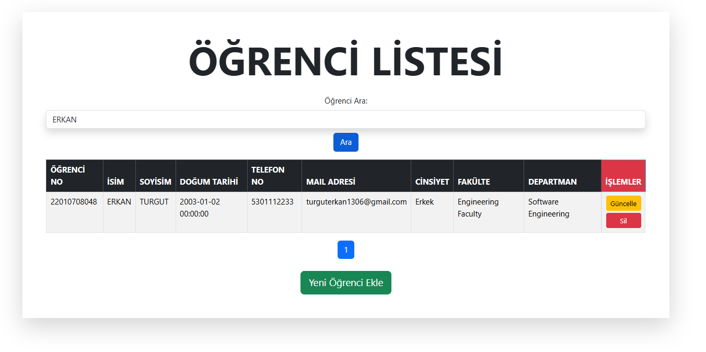
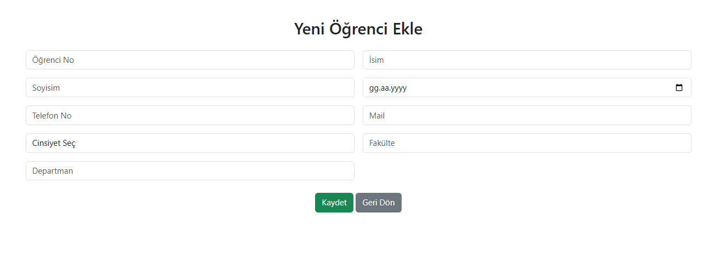
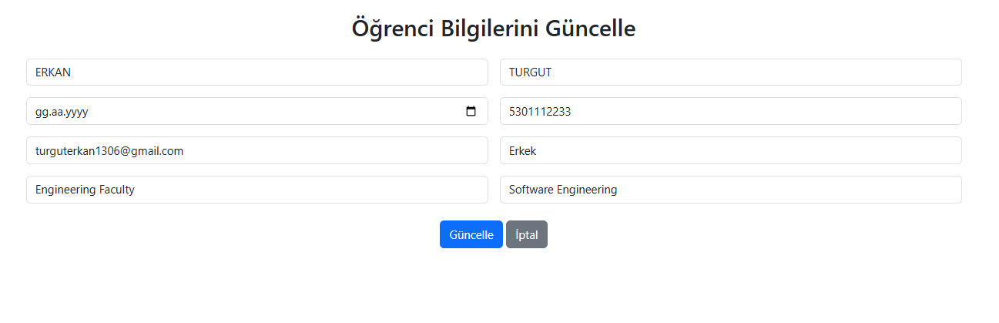

# 🎓 Öğrenci Yönetim Sistemi

Bu proje, PHP ve MySQL kullanılarak geliştirilmiş basit bir **Öğrenci Yönetim Sistemi**'dir. Kullanıcı arayüzü Bootstrap ile tasarlanmıştır. Sistem üzerinden öğrenci ekleme, listeleme, arama, silme ve güncelleme işlemleri yapılabilmektedir. (Pratik ve eğitim amaçlı yaptığım bir uygulamadır.)

---

## 🚀 Özellikler

- 🔍 Öğrenci arama (öğrenci numarasına göre)
- ➕ Yeni öğrenci ekleme
- 📝 Var olan öğrenciyi güncelleme
- 📋 Öğrenci listesini görüntüleme
- ❌ Öğrenci Kaydı Silme

---

## 📸 Ekran Görüntüleri

### 🧾 Öğrenci Listeleme Sayfası


---

### 🔍 Öğrenci Arama


---

### ➕ Öğrenci Ekleme


---

### 📝 Öğrenci Güncelleme


---

## ⚙️ Kurulum

1. Projeyi indirin veya klonlayın:

```bash
git clone https://github.com/Erkan3034/PHP_TUTORIALS/tree/main/Mini_Exercises/crud_islemleri.git
